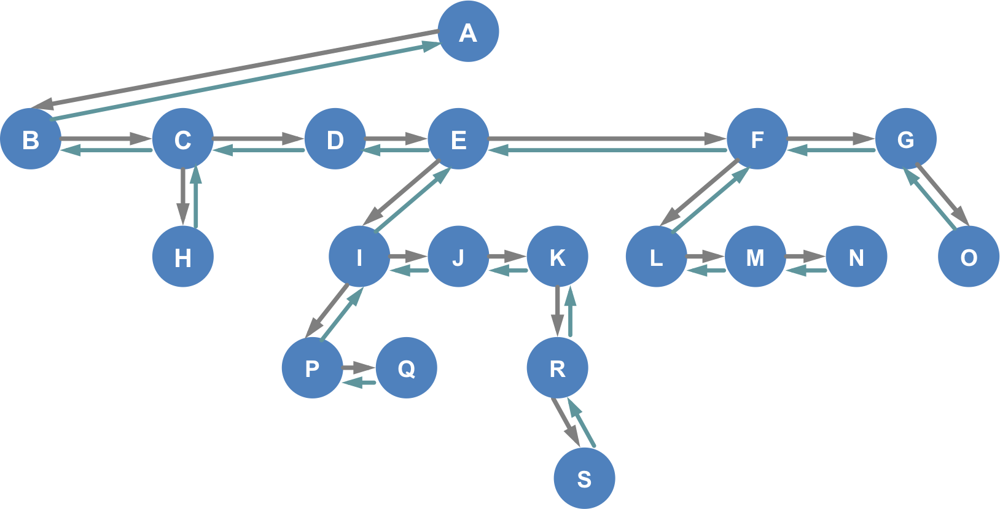

Practice Problems
========================

Learning Objectives
-------------------
- Finding a Node in a General Tree
- Removing a Node from a General Tree

<hr>


**Recall the following general tree where an object of type `FHtreeNode` may have at most one `chld`, one `prev` and one `sib` reference:**

```java
public class FHtreeNode<E>
{
   protected FHtreeNode<E> firstChild, sib, prev;
   protected E data;
   protected FHtreeNode<E> myRoot;  // needed to test for certain error

   public FHtreeNode( E d, FHtreeNode<E> sb, FHtreeNode<E> chld, FHtreeNode<E> prv )
   {
      firstChild = chld; 
      sib = sb;
      prev = prv;
      data = d;
      myRoot = null;
   }
   
   // ...
}
```

<br>

**Given the follwoing `find()` method from class FHtree`:**
```java
public FHtreeNode<E> find(FHtreeNode<E> root, E x, int level)
{
    FHtreeNode<E> retval;

    // first
    if (mSize == 0 || root == null)
        return null;

    // second
    if (root.data.equals(x))
    retu    rn root;

    // otherwise, recurse.  don't process sibs if this was the original call
    if ( level > 0 && (retval = find(root.sib, x, level)) != null )
        return retval;
    return find(root.firstChild, x, ++level);
}
```

<br>
**Use the following general tree to answer problems 1 and 2.**

<p>general tree:
        </p>


<br><br>

Problem 1
---------
**Assume that the call `find(nodeF, N, 1)` is made. Starting at node F, find node N.**

*Note: nodeF is a reference to node F.*

- Trace the method calls.
- Specify the return value after each call is completed.

<br>


Problem 2
---------
**Assume the call `find(nodeA, N, 0)` is made. Starting at node A, find node N.**

*Note: to reduce the number of calls that you have trace starting at A,
   skip tracing `find(nodeE.firstChild, N, 2)`*

<br>

**Given the following `addChild()` method from class `FHtreeNode`:**
```java
   public FHtreeNode<E> addChild( FHtreeNode<E> treeNode,  E x )
   {
      // empty tree? - create a root node if user passes in null
      if (mSize == 0)
      {
         if (treeNode != null)
            return null; // error something's fishy.  treeNode can't right
         mRoot = new FHtreeNode<E>(x, null, null, null);
         mRoot.myRoot = mRoot;
         mSize = 1;
         return mRoot;
      }
      if (treeNode == null)
         return null; // error inserting into non_null tree with a null parent
      if (treeNode.myRoot != mRoot)
         return null;  // silent error, node does not belong to this tree

      // push this node into the head of the sibling list; adjust prev pointers
      FHtreeNode<E> newNode = new FHtreeNode<E>(x, 
         treeNode.firstChild, null, treeNode, mRoot);  // sb, chld, prv, rt
      treeNode.firstChild = newNode;
      if (newNode.sib != null)
         newNode.sib.prev = newNode;
      ++mSize;
      return newNode;  
   }
```

<br><br>

Problem 3
---------
**Given reference to node with `P` called refP, what does the tree look like after adding newNode with `T`?**

- Trace the implementation of addChild() method.
- Show changes in links between nodes in the section of the tree that is being modified.
- Redraw the tree after adding newNode.

<p></p>

<br><br>


Problem 4
---------
**Given reference to node with `R` called refR, what does the tree look like after adding newNode with `T`?**

- Trace the implementation of addChild() method.
- Show changes in links between nodes in the section of the tree that is being modified.
- Redraw the tree after adding newNode.

<p></p>

<br><br>

Problem 5
---------
**Given reference to node with `I` called refI, what does the tree look like after adding newNode with `T`?**

- Trace the implementation of addChild() method.
- Show changes in links between nodes in the section of the tree that is being modified.
- Redraw the tree after adding newNode.

<p></p>

<br><br>

**Given the following `removeNode()` method from class `FHtreeNode`:**
```java
void removeNode(FHtreeNode<E> nodeToDelete )
{
    if (nodeToDelete == null || mRoot == null)
        return;
    if (nodeToDelete.myRoot != mRoot)
        return;  // silent error, node does not belong to this tree

    // remove all the children of this node 
    /* (not needed due to Java GC, but how done in other languages)
     * while (nodeToDelete.firstChild != null)
     *    removeNode(nodeToDelete.firstChild);  
     */

    if (nodeToDelete.prev == null)
        mRoot = null;     // last node in tree
    else if (nodeToDelete.prev.sib == nodeToDelete)
        nodeToDelete.prev.sib = nodeToDelete.sib; // adjust left sibling
    else
        nodeToDelete.prev.firstChild = nodeToDelete.sib;  // adjust parent

    // adjust the successor sib's prev pointer
    if (nodeToDelete.sib != null)
        nodeToDelete.sib.prev = nodeToDelete.prev;
}
```
<br><br>

**Use the following general tree to answer problems 6 through 9.**

<p>general tree:
        </p>


<br><br>


Problem 6
---------
**What does the tree look like after removing node `N`?**

- Trace the implementation of removeNode() method.
- Redraw the tree after removing node N.
- List the nodes that are garbage collected (GC-ed).

<p></p>
        
<br><br>


Problem 7
---------
**What does the tree look like after removing node `K`?**

- Trace the implementation of removeNode() method.
- Redraw the tree after removing node K.
- List the nodes that are garbage collected (GC-ed).

<p></p>
        
<br><br>


<br><br>

Problem 8
---------
**What does the tree look like after removing node `M`?**

- Trace the implementation of removeNode() method.
- Redraw the tree after removing node M.
- List the nodes that are garbage collected (GC-ed).

<p></p>
        
<br><br>


<br><br>


Problem 9
---------
**What does the tree look like after removing node `L`?**

- Trace the implementation of removeNode() method.
- Redraw the tree after removing node L.
- List the nodes that are garbage collected (GC-ed).

<p></p>
        
<br><br>


<br><br>


Problem 10
---------
**What does the tree look like after removing node `F`?**

- Trace the implementation of removeNode() method.
- Redraw the tree after removing node F.
- List the nodes that are garbage collected (GC-ed).

<p></p>
        
<br><br>


 